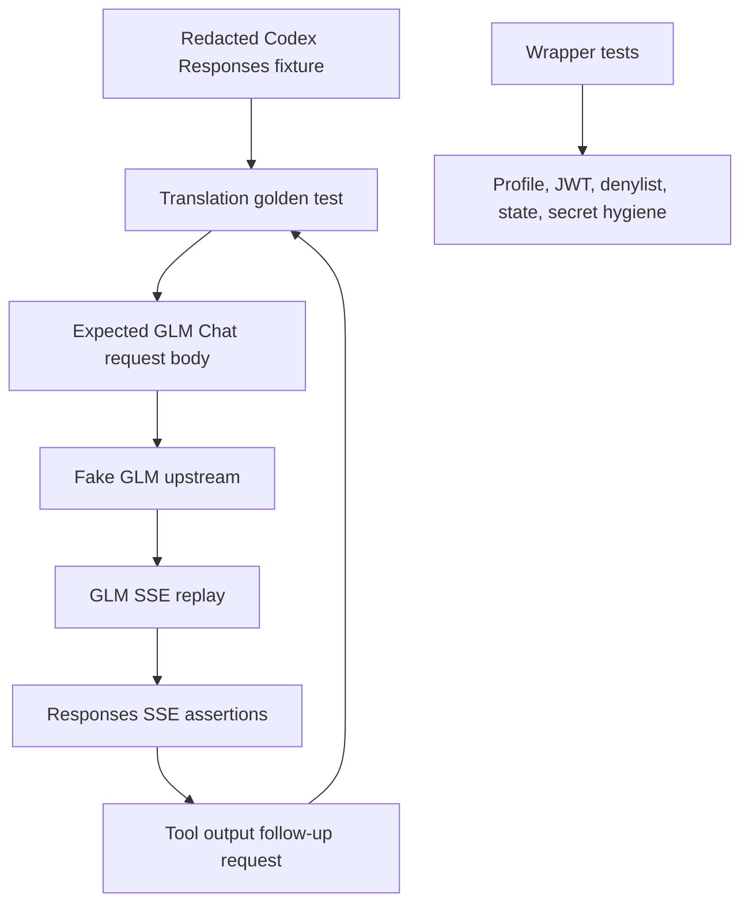

# feat: Add Relay Reliability Fixtures

## Goal Capsule

| Field | Value |
|---|---|
| Objective | Add an offline-first reliability fixture pack that proves Codex Responses traffic survives translation to GLM Chat Completions and back. |
| Authority | Preserve the current GLM relay workflow and wrapper behavior documented in `README.md` and `work/glm-relay.md`. |
| Execution profile | Test-first hardening: add fixtures and failing expectations before changing translator or wrapper behavior. |
| Stop conditions | Stop if fixture capture requires storing secrets, unredacted prompts, generated JWTs, or live-provider responses in the repo. |
| Tail ownership | Live Z.ai smoke tests and subagent enablement remain follow-up gates after offline reliability is proven. |

---

## Product Contract

### Summary

The reliability pack should make the relay explainable and testable without calling Z.ai: saved Codex request shapes, expected GLM request bodies, fake GLM streams, tool round-trip checks, and wrapper lifecycle tests.
The first version is about deterministic proof of the bridge, not expanding model-picker behavior or enabling subagent tools by default.

### Problem Frame

The current repo can run GLM through a local relay, but the proof is mostly a live smoke path plus the vendored relay's existing regression tests.
That leaves three practical gaps: real Codex Desktop request shapes can drift, stream translation failures are hard to diagnose, and wrapper failures around JWT/profile/state handling can break daily use even when the Rust relay is correct.

### Requirements

- R1. The repo contains a redacted, version-labeled Codex request fixture set that represents the GLM relay traffic we care about.
- R2. The relay tests assert Responses-to-Chat translation for GLM-specific request behavior, including tools, reasoning, previous response history, and parallel tool flags where present.
- R3. The relay tests replay GLM-style streaming chunks and assert the resulting Responses SSE events, including text, reasoning, tool calls, completion, usage, and incomplete stream behavior.
- R4. The tests prove a normal Codex tool round trip through function call output without enabling subagent or multi-agent tools by default.
- R5. Wrapper tests cover JWT generation, malformed key handling, profile writing, model catalog wiring, tool denylist defaults, state metadata, and secret hygiene.
- R6. The offline test path does not require a live Z.ai key, token spend, or network availability.
- R7. Documentation explains how to regenerate fixtures safely and how to run offline versus optional live checks.

### Acceptance Examples

- AE1. Given a redacted Codex request with a normal tool schema, when the translation test runs, then the upstream Chat request includes the expected tool definitions and no denied subagent tools.
- AE2. Given a fake GLM stream with reasoning and final text, when the stream replay test runs, then the relay emits reasoning summary deltas, output text deltas, and a completed Responses event with usage.
- AE3. Given a fake GLM stream that asks for a tool call, when Codex sends the matching function call output in the next request, then the relay sends GLM a valid tool result message and does not duplicate prior tool calls.
- AE4. Given a malformed `ZAI_RAW_KEY`, when the wrapper's auth path is exercised, then it fails clearly without writing raw key material or a generated JWT to state, logs, or profile output.

### Scope Boundaries

In scope:

- Offline fixtures and tests for the vendored Rust relay.
- Python wrapper tests for local lifecycle and secret-safety behavior.
- Fixture capture/redaction guidance sufficient to maintain the corpus after Codex upgrades.
- Documentation that separates offline gates from optional live GLM smoke checks.

Deferred to follow-up work:

- Live Z.ai CI tests gated by real credentials.
- Removing or relaxing the default subagent and multi-agent tool denylist.
- Desktop model-picker integration or a macOS menu-bar control surface.
- A full semantic tool-planning layer that teaches GLM when to prefer one tool over another.

---

## Planning Contract

### Key Technical Decisions

- KTD1. Extend the vendored relay's existing offline test style instead of building a separate harness.
  `third_party/codex-relay/tests/regression_issues.rs` already starts a local mock upstream, captures outgoing Chat bodies, and replays SSE responses, so GLM fixture work should reuse that structure.
- KTD2. Store Codex request fixtures under the relay fixture tree with a GLM/Codex-version label.
  The existing `third_party/codex-relay/tests/fixtures/codex_0_128_0/` convention and `VERSIONS.md` file already define how compatibility fixtures are named and maintained.
- KTD3. Keep live Z.ai checks optional and ignored.
  Reliability should not depend on user balance, provider availability, or secret injection; live checks can be documented as smoke tests only.
- KTD4. Test the wrapper as a first-class reliability surface.
  `work/glm-relay` owns JWT generation, profile writing, relay process state, and denylist defaults, which are visible user failures even when protocol translation is correct.
- KTD5. Preserve the current v1 tool safety boundary.
  The fixture pack should prove normal tool calls and denylist filtering before testing GLM-driven subagent calls.

### High-Level Technical Design



The plan uses two layers of proof.
The Rust layer proves the protocol bridge: request translation, stream back-translation, session history, reasoning, and tool round trips.
The Python layer proves the local operating wrapper: configuration, JWT creation, process metadata, and no-secret persistence.

### Assumptions

- The fixture corpus can be built from already captured/redacted request shapes or newly captured local requests with private text trimmed before commit.
- Unit-level wrapper tests can import or execute `work/glm-relay` without requiring a live relay binary for every scenario.
- Any required refactor to make `work/glm-relay` testable should be narrow and behavior-preserving.

### Sources & Research

- `README.md` documents the local relay profile, GLM endpoint wrapper, tool policy, and local data sensitivity.
- `work/glm-relay.md` documents setup, JWT refresh, model catalog wiring, and the current subagent denylist.
- `work/glm-relay` contains the wrapper functions and CLI paths that need Python coverage.
- `third_party/codex-relay/tests/compat_codex_0_128.rs` establishes the current fixture-driven Codex compatibility pattern.
- `third_party/codex-relay/tests/regression_issues.rs` establishes the current local mock upstream and stream replay pattern.
- `third_party/codex-relay/src/translate.rs` and `third_party/codex-relay/src/stream.rs` are the primary translation surfaces under test.

### Risks & Dependencies

- Fixture drift: Codex request shape can change after CLI or Desktop upgrades, so `VERSIONS.md` must record capture version and date.
- Snapshot brittleness: golden request bodies should normalize nondeterministic ids and assert meaningful protocol shape rather than generated values.
- Secret exposure: fixture capture must reject raw keys, generated JWTs, bearer tokens, logs, relay history, and unredacted local paths before commit.
- Wrapper testability: `work/glm-relay` may need a narrow extraction for deterministic tests, but the CLI contract should stay unchanged.

---

## Output Structure

```text
docs/plans/
  2026-07-06-001-feat-relay-reliability-fixtures-plan.md
tests/
  test_glm_relay_wrapper.py
third_party/codex-relay/tests/
  compat_codex_glm.rs
  compat_glm_stream.rs
third_party/codex-relay/tests/fixtures/
  codex_glm_current/
    text_only.json
    tool_call_request.json
    tool_output_followup.json
    reasoning_request.json
    parallel_tools_request.json
    expected_chat/
      text_only.json
      tool_call_request.json
      tool_output_followup.json
      reasoning_request.json
      parallel_tools_request.json
    glm_streams/
      text.sse
      reasoning.sse
      tool_call.sse
```

The exact fixture filenames may change during implementation if the captured shapes suggest better names, but the directory layout should keep request fixtures, expected upstream bodies, and stream inputs visibly separate.

---

## Implementation Units

### U1. Fixture Corpus And Maintenance Notes

- **Goal:** Add the GLM/Codex fixture corpus and document how it was captured, minimized, and redacted.
- **Requirements:** R1, R6, R7.
- **Dependencies:** None.
- **Files:** `third_party/codex-relay/tests/fixtures/VERSIONS.md`, `third_party/codex-relay/tests/fixtures/codex_glm_current/*.json`, `third_party/codex-relay/tests/fixtures/codex_glm_current/expected_chat/*.json`, `third_party/codex-relay/tests/fixtures/codex_glm_current/glm_streams/*.sse`.
- **Approach:** Follow the existing `codex_0_128_0` fixture style, but create a GLM-focused directory that covers text-only, normal tool call, tool output follow-up, reasoning, and parallel tool request shapes.
  Keep fixtures hand-minimized so they preserve protocol shape without committing user prompts, secrets, local absolute paths, or full tool registries.
- **Execution note:** Start with fixture files before translator changes so later behavior changes have stable examples to satisfy.
- **Patterns to follow:** `third_party/codex-relay/tests/fixtures/codex_0_128_0/with_namespace_tool.json`, `third_party/codex-relay/tests/fixtures/VERSIONS.md`.
- **Test scenarios:**
  - Happy path: parse every GLM fixture into `ResponsesRequest` without errors.
  - Edge case: minimized fixtures still include the fields that caused relay complexity: `instructions`, `input`, `tools`, `stream`, reasoning-related fields, and parallel tool metadata where relevant.
  - Failure path: a fixture redaction audit finds no raw Z.ai key shape, bearer token, generated JWT-like value, or unredacted absolute home path.
- **Verification:** Fixture tests load every file, `VERSIONS.md` explains the GLM fixture source and capture date, and no committed fixture contains secrets or user-private local paths.

### U2. GLM Translation Golden Tests

- **Goal:** Assert exact Responses-to-Chat translation for GLM request fixtures.
- **Requirements:** R2, R4, R6.
- **Dependencies:** U1.
- **Files:** `third_party/codex-relay/tests/compat_codex_glm.rs`, `third_party/codex-relay/tests/fixtures/codex_glm_current/*.json`, `third_party/codex-relay/tests/fixtures/codex_glm_current/expected_chat/*.json`, `third_party/codex-relay/src/translate.rs`.
- **Approach:** Add a compatibility test module that loads each Codex fixture, calls `to_chat_request`, normalizes nondeterministic fields if any appear, and compares the produced Chat body against the expected fixture.
  Cover GLM-specific thinking enablement, tool conversion, denied tool omission, namespace flattening where applicable, `function_call_output` mapping to Chat tool messages, and previous-response dedupe behavior.
- **Execution note:** Make the golden tests fail first for any missing expected fixture or mismatch before changing translator behavior.
- **Patterns to follow:** `third_party/codex-relay/tests/compat_codex_0_128.rs`, `third_party/codex-relay/tests/regression_issues.rs`.
- **Test scenarios:**
  - Happy path: text-only fixture becomes system plus user Chat messages with `thinking: {"type":"enabled"}` for `glm-5.2`.
  - Happy path: normal function tools become Chat Completions `tools` entries with nested `function` shape.
  - Happy path: `function_call_output` becomes a Chat `tool` role message with the correct `tool_call_id`.
  - Edge case: parallel function call items group into one assistant message with multiple `tool_calls`.
  - Edge case: denied subagent and multi-agent tools are omitted while normal tools remain available.
  - Failure path: unknown top-level Codex fields are ignored rather than causing parse or translation failure.
- **Verification:** Golden tests show a deterministic diff when translation output changes, and the test names explain which relay contract changed.

### U3. GLM Stream Replay And Responses Event Tests

- **Goal:** Replay GLM-style SSE chunks through the local relay and assert Responses event sequences.
- **Requirements:** R3, R6.
- **Dependencies:** U1.
- **Files:** `third_party/codex-relay/tests/compat_glm_stream.rs`, `third_party/codex-relay/tests/fixtures/codex_glm_current/glm_streams/*.sse`, `third_party/codex-relay/src/stream.rs`, `third_party/codex-relay/tests/regression_issues.rs`.
- **Approach:** Reuse the existing mock upstream pattern to return fixture SSE streams from `/v1/chat/completions`, post a Responses request to `/v1/responses`, collect emitted SSE events, and assert the event names and output item payloads Codex needs.
  Keep fixture streams small but cover text, reasoning via both `reasoning_content` and `reasoning` field names when useful, tool call deltas, usage, `[DONE]`, and clean close without `[DONE]`.
- **Execution note:** Prefer event-shape assertions over snapshotting every generated id, because ids are intentionally nondeterministic.
- **Patterns to follow:** `issue_5_streaming_completed_event_includes_usage`, `issue_26_streaming_reasoning_content_emits_responses_reasoning_events`, and `issue_17_streaming_namespaced_tool_calls_emit_namespace_field` in `third_party/codex-relay/tests/regression_issues.rs`.
- **Test scenarios:**
  - Happy path: text stream emits `response.created`, message output item, text deltas, output item done, and `response.completed`.
  - Happy path: reasoning stream emits a reasoning output item and reasoning summary deltas before completion.
  - Happy path: tool-call stream emits function call added, argument delta, function call done, and completed output.
  - Edge case: usage chunks with cache token fields map into Responses usage details.
  - Error path: upstream non-success status emits `response.failed` without saving a successful session turn.
  - Error path: an incomplete stream without content fails, while a clean close after content completes as the existing relay policy requires.
- **Verification:** Stream replay tests run fully offline and fail with event-level evidence when the Responses stream contract changes.

### U4. Normal Tool Round-Trip Fixture

- **Goal:** Prove the complete normal-tool loop across two relay turns.
- **Requirements:** R3, R4, R6.
- **Dependencies:** U2, U3.
- **Files:** `third_party/codex-relay/tests/compat_glm_stream.rs`, `third_party/codex-relay/tests/fixtures/codex_glm_current/tool_call_request.json`, `third_party/codex-relay/tests/fixtures/codex_glm_current/tool_output_followup.json`, `third_party/codex-relay/src/translate.rs`, `third_party/codex-relay/src/session.rs`.
- **Approach:** Add a two-turn offline test: first turn returns a GLM tool call, the test captures the response id and function call id, second turn sends a matching `function_call_output`, and the captured upstream Chat body is inspected for the expected `tool` message and absence of duplicated assistant tool calls.
  Use a normal local tool shape rather than subagent tools.
- **Execution note:** Keep subagent tool calls out of this unit unless normal tool round trip is already green.
- **Patterns to follow:** Existing session/history assertions in `third_party/codex-relay/tests/regression_issues.rs` and the `previous_response_id` handling in `third_party/codex-relay/src/translate.rs`.
- **Test scenarios:**
  - Happy path: first turn emits one function call item with stable call id propagation.
  - Happy path: second turn sends GLM a Chat `tool` role message containing the tool output.
  - Edge case: previous response history plus replayed input does not duplicate the same function call.
  - Failure path: denied subagent tool names are absent from the upstream tools list even if included in the incoming Codex tool list.
- **Verification:** A two-turn offline test demonstrates that GLM can drive normal Codex tools through the relay without enabling subagent runtime calls.

### U5. Wrapper Reliability And Secret Hygiene Tests

- **Goal:** Add Python tests for the wrapper paths that can break daily use independently of relay translation.
- **Requirements:** R5, R6.
- **Dependencies:** None.
- **Files:** `tests/test_glm_relay_wrapper.py`, `work/glm-relay`, `work/glm-model-catalog.json`, `.gitignore`.
- **Approach:** Test `work/glm-relay` through import-level function calls where practical and subprocess-level CLI calls where the CLI surface is the contract.
  Use temporary directories and `unittest.mock` patching to avoid writing real `~/.codex` files, starting real relays, or requiring `ZAI_RAW_KEY`.
  If direct testing is awkward, make a narrow behavior-preserving extraction inside `work/glm-relay` rather than adding a second wrapper module.
- **Execution note:** Treat secret hygiene as a blocking test: raw keys and generated JWTs must not appear in state, profile, or log test artifacts.
- **Patterns to follow:** Existing wrapper functions `generate_zai_jwt`, `write_profile`, `install_relay`, `start_relay`, `restart_if_needed`, and the repo's `.gitignore` exclusions.
- **Test scenarios:**
  - Happy path: a syntactically valid raw key produces a JWT-like token and expiry timestamp without writing either value to state.
  - Edge case: missing, non-dotted, empty-id, and empty-secret keys fail with clear messages.
  - Happy path: profile writing produces `wire_api = "responses"`, local base URL, GLM model id, and `model_catalog_json`.
  - Happy path: default denylist includes both legacy subagent names and `multi_agent_v1-*` names.
  - Edge case: auto install source selects vendored when vendored source and Rust tools are available, otherwise selects PyPI.
  - Failure path: generated state and profile files contain no raw key, generated JWT, or bearer token.
- **Verification:** Python wrapper tests run without network, without live credentials, and without modifying the user's real Codex config.

### U6. Offline Test Documentation

- **Goal:** Provide a clear way to run the reliability pack and understand what it proves.
- **Requirements:** R6, R7.
- **Dependencies:** U2, U3, U4, U5.
- **Files:** `README.md`, `work/glm-relay.md`.
- **Approach:** Document the offline Rust and Python test gates, the fixture regeneration path, the secret-redaction rules, and the boundary between offline reliability and optional live GLM smoke.
- **Execution note:** Documentation should describe outcomes rather than becoming a long command cookbook.
- **Patterns to follow:** Existing `README.md` setup/run/tool policy sections and `third_party/codex-relay/tests/fixtures/VERSIONS.md` regeneration notes.
- **Test scenarios:**
  - Happy path: README tells a new user which offline gates prove translation, streaming, tool round trip, and wrapper behavior.
  - Edge case: documentation makes clear that live Z.ai tests are optional and credential-gated.
  - Failure path: docs never instruct users to commit raw keys, JWTs, state history, logs, or unredacted captured requests.
- **Verification:** A reader can distinguish offline confidence checks from live smoke checks and can regenerate fixtures without leaking local secrets.

---

## Verification Contract

| Gate | Applies to | Done signal |
|---|---|---|
| `cargo test --manifest-path third_party/codex-relay/Cargo.toml` | U1, U2, U3, U4 | Vendored relay tests pass offline, including the new GLM compatibility and stream replay tests. |
| `python3 -m unittest discover -s tests` | U5 | Wrapper tests pass without live credentials or network. |
| Fixture secret scan | U1, U5, U6 | No raw key shape, generated JWT, bearer token, or unredacted home path appears in committed fixtures, docs, profiles, or state samples. |
| Documentation review | U6 | README and wrapper notes explain offline versus live checks and preserve the existing subagent denylist posture. |

---

## Definition of Done

- All GLM/Codex fixture files are minimized, redacted, version-labeled, and documented.
- Translation golden tests cover text, tools, tool output follow-up, reasoning, denied tools, and parallel tool shapes.
- Stream replay tests cover text, reasoning, tool call, usage, completion, and failure/incomplete-stream cases.
- A two-turn normal tool round-trip test passes offline.
- Wrapper tests prove JWT/profile/denylist/state behavior without writing secrets or touching the user's real Codex config.
- Documentation clearly separates offline reliability gates from optional live Z.ai smoke tests.
- No abandoned experimental fixture formats, temporary captures, generated state, logs, or local history files remain in the diff.
