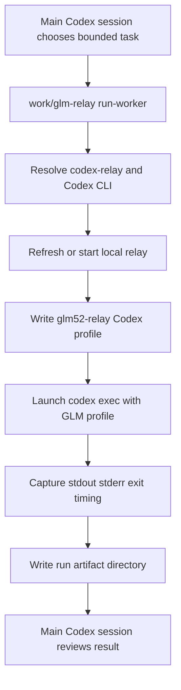

# feat: Add GLM Worker Lane

## Goal Capsule

| Field | Value |
|---|---|
| Objective | Add a first-version GLM worker command that lets the main Codex session delegate one bounded coding task to a GLM-backed Codex CLI run. |
| Authority | Preserve the current relay wrapper, profile, fixture, CI, live-smoke, and default tool-denylist behavior. |
| Execution profile | Wrapper-first implementation with offline unit coverage, then optional live/manual proof after offline checks pass. |
| Stop conditions | Stop if the implementation would store raw Z.ai keys, generated JWTs, bearer tokens, unredacted relay history, or prompt artifacts in tracked files. |
| Tail ownership | The main Codex session remains planner and reviewer; GLM worker output is evidence to inspect, not automatically trusted. |

---

## Product Contract

### Summary

The worker lane turns the working relay into a usable delegation loop: Codex plans a focused task, `work/glm-relay run-worker` prepares the relay/profile, launches `codex --profile glm52-relay exec` with GLM-5.2 behind the relay, saves run artifacts, and reports where the main session should review the attempt.
This version optimizes for inspectability over Desktop model-picker polish.

### Problem Frame

The repo already proves the bridge can work: `work/glm-relay` can install/start/refresh the relay, write a Codex profile, run a live GLM smoke, and exercise offline fixtures in CI.
That still leaves the daily workflow manual.
The user wants to plan with Codex and have GLM attempt implementation work without replacing the existing Codex model path or hiding the result inside the Desktop model picker.

### Requirements

- R1. The wrapper exposes a `run-worker` command that accepts one bounded task prompt and runs it through the GLM relay profile.
- R2. The command prepares the local prerequisites it owns: relay binary discovery, relay readiness or refresh, Codex profile writing, and Codex CLI discovery.
- R3. The command writes a per-run artifact directory under ignored local output state containing the prompt, metadata, stdout, stderr, exit code, timing, and relay status snapshot.
- R4. The command returns a concise terminal summary with the exit code, elapsed time, artifact directory, and recommended review action.
- R5. The command keeps the current default subagent and multi-agent denylist unless the user explicitly overrides relay startup options.
- R6. The command does not run a live smoke by default because worker execution itself is already a live provider call; any smoke-first behavior is explicit.
- R7. Offline tests cover worker command construction, prerequisite failures, artifact capture, non-secret metadata, and failure reporting without requiring live Z.ai credentials.
- R8. Documentation explains the Codex-orchestrator/GLM-worker workflow, what artifacts are saved, and how to review or clean them up.

### Acceptance Examples

- AE1. Given `ZAI_RAW_KEY` is set and no relay is running, when the user runs `work/glm-relay run-worker "make a small doc edit"`, then the wrapper starts the relay, writes the profile, runs Codex with the GLM profile, and saves a run directory.
- AE2. Given a relay is already running with a JWT that is still fresh, when `run-worker` starts, then it reuses the running relay rather than restarting it.
- AE3. Given the Codex CLI is missing, when `run-worker` starts, then it fails before contacting GLM and writes a clear failure summary without leaking secrets.
- AE4. Given the GLM-backed Codex run exits nonzero, when `run-worker` finishes, then stdout, stderr, exit code, metadata, and elapsed time are still captured for review.
- AE5. Given the user has not opted into subagent tools, when `run-worker` prepares the relay, then the existing subagent and multi-agent denylist remains active.

### Scope Boundaries

In scope:

- A CLI-first worker lane in `work/glm-relay`.
- Per-run local artifacts under `outputs/`.
- Offline unit tests for worker orchestration and artifact behavior.
- README and operational-note updates for the new workflow.

Deferred to follow-up work:

- Desktop model-picker integration for GLM.
- A macOS menu-bar app or launcher UI.
- Nested GLM subagents through Codex's multi-agent tools.
- Automatic quality judgment of GLM's diff beyond capturing outputs for Codex review.
- Live CI against Z.ai credentials.

---

## Planning Contract

### Key Technical Decisions

- KTD1. Build the worker as a wrapper subcommand, not a relay protocol change.
  The relay already translates Responses traffic; the missing layer is local orchestration around profile, process, and evidence capture.
- KTD2. Use Codex CLI as the worker harness.
  Calling `codex --profile glm52-relay exec` preserves Codex's existing tool/runtime behavior while swapping the model path through the relay profile.
- KTD3. Capture artifacts by default.
  GLM output needs review by the main Codex session, and artifact capture makes failures debuggable without rerunning paid/provider-dependent work.
- KTD4. Keep live smoke explicit.
  `live-smoke` already proves auth and endpoint wiring; `run-worker` should not spend an extra request before every worker task unless the user asks for that gate.
- KTD5. Preserve the v1 tool safety boundary.
  Normal tool calls are in scope, while subagent and multi-agent runtime calls stay denied until a separate runtime proof shows the local Codex daemon can execute returned calls reliably.
- KTD6. Keep artifacts local and ignored.
  `outputs/` is already ignored and is the right place for prompt/output logs that may contain private repo or user context.

### High-Level Technical Design



The worker command is a workflow primitive above the existing bridge.
It does not teach GLM new tool semantics and does not add GLM to the Desktop picker.
It gives Codex a repeatable way to ask GLM for one focused implementation attempt and then inspect what happened.

### Artifact Shape

```text
outputs/
  glm-worker-runs/
    20260707-153012-small-doc-edit/
      prompt.txt
      metadata.json
      stdout.txt
      stderr.txt
      exit_code.txt
      summary.txt
```

`metadata.json` should contain non-secret runtime facts such as model, profile, cwd, port, pid if known, start/end timestamps, duration, redacted command argv, exit code, and relay log path.
It must not contain raw keys, generated JWTs, bearer tokens, or copied relay history.

### Assumptions

- The Codex CLI remains available as `codex` or through an explicit environment override.
- The existing `glm52-relay` profile path is the intended first worker profile.
- The user is comfortable with prompt and output artifacts being stored locally under ignored `outputs/`.
- Worker review is done by the main Codex session after the command finishes; the worker command itself does not decide whether GLM's edit is good.

### Sources & Research

- `work/glm-relay` already owns relay lifecycle, JWT generation, profile writing, live smoke payloads, local port waiting, logs, and common start args.
- `tests/test_glm_relay_wrapper.py` establishes the wrapper unit-test style using `unittest`, temporary directories, and mocks instead of live credentials.
- `README.md` and `work/glm-relay.md` document current setup, live smoke, offline tests, local data sensitivity, and tool policy.
- `.github/workflows/offline-reliability.yml` already runs wrapper tests and fixture hygiene on push and pull requests.
- `.gitignore` already excludes `outputs/`, `work/.glm-relay/`, and `work/.venv/`.
- `docs/plans/2026-07-06-001-feat-relay-reliability-fixtures-plan.md` established the current offline-first reliability posture.

### Risks & Dependencies

- Codex CLI behavior may change, so worker construction should be tested around argv and documented around the currently observed `exec` path.
- Worker artifacts may contain private prompts or tool outputs, so they must remain ignored and be treated as local sensitive data.
- Provider failures, account balance issues, and model behavior remain live-run risks; offline tests can prove wrapper behavior but not GLM quality.
- Long-running workers can leave confusing partial changes in the repo; the summary should remind the main session to inspect git diff and tests.
- The worker can make the workflow feel more automatic than it is; docs should state that Codex review is required before trusting GLM output.

---

## Implementation Units

### U1. Worker Run Model And Artifact Helpers

- **Goal:** Add small helper functions for worker run directories, safe slugs, metadata writing, duration capture, and Codex CLI discovery.
- **Requirements:** R3, R4, R7.
- **Dependencies:** None.
- **Files:** `work/glm-relay`, `tests/test_glm_relay_wrapper.py`.
- **Approach:** Keep helpers inside `work/glm-relay` to match the current single-file wrapper style.
  Generate a timestamped directory under `outputs/glm-worker-runs/`, derive a short slug from the prompt or explicit label, and write text/json artifacts through a central writer that makes directories first.
  Resolve the Codex CLI through `CODEX_BIN` when set, then `shutil.which("codex")`, failing before relay startup if unavailable.
- **Patterns to follow:** Existing `ensure_dirs`, `save_state`, `find_relay_binary`, `logs`, and temporary-directory test patterns.
- **Test scenarios:**
  - Happy path: a normal prompt creates a deterministic run directory under a mocked `OUT` path with safe ASCII slug characters.
  - Edge case: an empty or punctuation-only prompt falls back to a generic worker slug.
  - Edge case: repeated runs do not overwrite an existing artifact directory.
  - Failure path: missing Codex CLI raises a clear `SystemExit` before any subprocess worker run is attempted.
  - Secret hygiene: metadata writer does not include raw key, JWT, bearer token, or environment dump fields.
- **Verification:** Unit tests prove artifact path generation and CLI discovery without invoking Codex or GLM.

### U2. Worker Preflight And Relay/Profile Preparation

- **Goal:** Reuse existing relay lifecycle functions so `run-worker` prepares the local GLM path before launching Codex.
- **Requirements:** R2, R5, R6, R7.
- **Dependencies:** U1.
- **Files:** `work/glm-relay`, `tests/test_glm_relay_wrapper.py`.
- **Approach:** Add a preflight function that resolves Codex CLI, ensures or refreshes relay state with `restart_if_needed`, waits for the configured local port when this invocation starts or restarts the relay, and writes the GLM profile through `write_profile`.
  Keep the default tool denylist flowing through `add_common_start_args`.
  Do not call `live_smoke` unless an explicit future flag is added.
- **Patterns to follow:** Existing `restart_if_needed`, `write_profile`, `wait_for_local_port`, `live_smoke`, and default `history_store` handling.
- **Test scenarios:**
  - Happy path: no running relay calls the start/refresh path and waits for the local port.
  - Happy path: fresh running relay reuses current state and still writes the profile.
  - Edge case: profile output path can be overridden in tests without touching the user's real home directory.
  - Failure path: missing `ZAI_RAW_KEY` while no relay is running fails with the existing key-required behavior.
  - Safety path: default tool denylist remains present in the arguments passed to relay preparation.
- **Verification:** Unit tests cover preflight behavior through mocks and do not start a real relay process.

### U3. Codex Worker Invocation And Capture

- **Goal:** Implement `run-worker` so it launches one GLM-backed Codex CLI task and captures the full process result.
- **Requirements:** R1, R3, R4, R5, R7.
- **Dependencies:** U1, U2.
- **Files:** `work/glm-relay`, `tests/test_glm_relay_wrapper.py`.
- **Approach:** Build argv around the resolved Codex binary, `--profile glm52-relay`, `exec`, and the task prompt, with options for working directory and timeout if added during implementation.
  Run via `subprocess.run` so stdout, stderr, return code, and elapsed time are captured.
  Write artifacts even on nonzero exit or timeout.
  Return the worker's exit code after printing a short summary.
- **Execution note:** Start with mocked subprocess tests before trying a live Codex worker call.
- **Patterns to follow:** Existing wrapper style for subprocess use in `install_relay` and `start_relay`, plus the existing smoke function's clear terminal messages.
- **Test scenarios:**
  - Happy path: command argv uses the GLM profile and passes the exact task prompt to the Codex `exec` process.
  - Happy path: stdout, stderr, exit code, redacted metadata, and summary files are written when the subprocess returns zero.
  - Failure path: nonzero subprocess return still writes artifacts and returns the same nonzero code.
  - Failure path: timeout writes a failure summary and does not hide partial stdout/stderr when available.
  - Edge case: worker run from a custom cwd records that cwd in metadata and passes it to Codex through the chosen invocation mechanism.
- **Verification:** Tests assert argv, artifact files, exit-code propagation, and summary content with a fake subprocess result.

### U4. CLI Surface And Help Text

- **Goal:** Add the public `run-worker` subcommand with conservative options and understandable help text.
- **Requirements:** R1, R2, R4, R6, R8.
- **Dependencies:** U1, U2, U3.
- **Files:** `work/glm-relay`, `tests/test_glm_relay_wrapper.py`.
- **Approach:** Register `run-worker` in `argparse` alongside existing subcommands.
  Accept a positional task string and optional flags for label, profile output path, working directory, timeout, and keeping relay behavior aligned with existing common start args.
  Keep smoke-first behavior out unless a flag is explicitly added and tested.
- **Patterns to follow:** Existing subcommand registration for `live-smoke`, `write-profile`, and `logs`.
- **Test scenarios:**
  - Happy path: parser accepts `run-worker "task"` and wires it to the worker function.
  - Happy path: parser exposes common relay options used by relay preparation.
  - Edge case: missing task exits with argparse usage rather than launching anything.
  - Failure path: invalid working directory is caught before invoking Codex.
- **Verification:** Parser and wrapper tests cover the CLI contract without live credentials.

### U5. Documentation And Review Workflow

- **Goal:** Document how to use the worker lane and how Codex should review GLM output.
- **Requirements:** R4, R8.
- **Dependencies:** U3, U4.
- **Files:** `README.md`, `work/glm-relay.md`.
- **Approach:** Add a section that explains the orchestration model in plain terms: Codex plans, GLM attempts, artifacts are saved, Codex reviews.
  Document the artifact directory shape, local sensitivity of prompts/outputs, default tool-denylist boundary, and recommended offline/live validation order.
- **Patterns to follow:** Existing README structure for setup, run, offline reliability, live smoke, tool policy, and local data.
- **Test scenarios:**
  - Documentation path: README shows `run-worker` after the current setup/profile/live-smoke context.
  - Documentation path: operational notes explain where worker artifacts live and that `outputs/` is ignored.
  - Safety path: docs warn that GLM worker output requires review before merge or push.
- **Verification:** Documentation matches the implemented CLI flags and does not include real keys, bearer tokens, generated JWTs, or absolute local home paths.

### U6. CI And Hygiene Coverage

- **Goal:** Keep the new worker behavior under the existing offline reliability gates.
- **Requirements:** R7, R8.
- **Dependencies:** U1, U2, U3, U4, U5.
- **Files:** `.github/workflows/offline-reliability.yml`, `tests/test_glm_relay_wrapper.py`, `.gitignore`.
- **Approach:** Reuse the current wrapper test job because `python3 -m unittest discover -s tests` already runs on pull requests and pushes.
  Extend secret scanning only if new tracked docs or fixture paths introduce new places where prompt artifacts might accidentally land.
  Confirm `outputs/` remains ignored for worker run artifacts.
- **Patterns to follow:** Existing wrapper job and fixture/doc secret scan.
- **Test scenarios:**
  - Happy path: wrapper tests include the worker cases and run under the existing CI command.
  - Secret hygiene: no new tracked doc or test fixture contains raw key shapes, generated JWT-like strings, bearer tokens, or local home paths.
  - Regression path: generated worker run artifacts are ignored and never required for tests.
- **Verification:** Existing CI workflow remains enough for offline worker coverage, or the plan's implementation extends it only where a new tracked surface requires scanning.

---

## Verification Contract

| Gate | Applies To | Done Signal |
|---|---|---|
| Python wrapper tests | U1, U2, U3, U4, U6 | `python3 -m unittest discover -s tests` passes without live credentials. |
| Rust relay tests | Regression guard for existing bridge | `cargo test --manifest-path third_party/codex-relay/Cargo.toml` remains green after wrapper changes. |
| Formatting check | Relay vendored code if touched | `cargo fmt --manifest-path third_party/codex-relay/Cargo.toml -- --check` remains green if Rust files change. |
| Secret hygiene scan | U3, U5, U6 | Tracked files contain no raw Z.ai key shape, generated JWT-like token, bearer token, or unredacted local home path. |
| Manual worker smoke | End-to-end proof after offline gates | With user-provided live credentials, a tiny `run-worker` task completes or fails with a captured artifact directory and no leaked secret material. |

The manual worker smoke is intentionally not a CI gate because it spends live provider calls and depends on account state.

---

## Definition of Done

- The wrapper exposes `run-worker` and its help text is understandable from `work/glm-relay --help`.
- `run-worker` prepares the existing GLM relay/profile path and invokes Codex through the GLM profile for one bounded task.
- Every worker attempt creates an ignored artifact directory containing prompt, stdout, stderr, exit code, metadata, timing, and a compact summary.
- Offline Python tests cover success, nonzero exit, missing prerequisites, artifact capture, denylist preservation, and secret-safe metadata.
- README and operational notes explain the workflow, artifact sensitivity, and review requirement.
- Existing relay fixture tests and wrapper tests pass.
- No raw Z.ai key, generated JWT, bearer token, relay history, or user-private local path is committed.
- Any dead-end implementation code from alternate worker approaches is removed before the work is declared complete.
