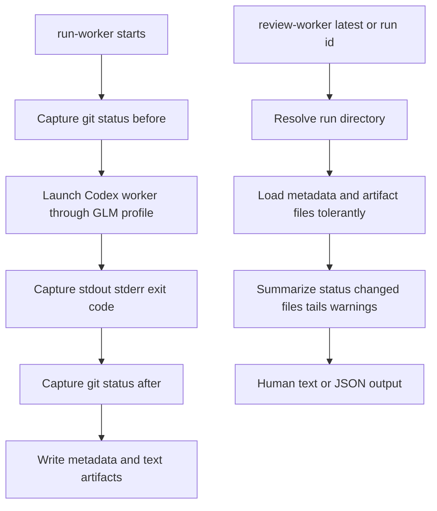

# GLM Worker Review Workflow - Plan

## Goal Capsule

| Field | Value |
|---|---|
| Objective | Complete the CLI-first GLM worker workflow by making worker run artifacts easy to inspect, compare, and hand back to Codex for review. |
| Authority | Preserve the existing relay lifecycle, profile writing, live-smoke behavior, default tool denylist, ignored artifact storage, and OpenAI/Codex planner path. |
| Execution profile | Wrapper-first implementation with offline unit coverage; live GLM calls remain optional proof, not required CI. |
| Stop conditions | Stop if the implementation would store raw Z.ai keys, generated JWTs, bearer tokens, relay history, full environment dumps, or prompt/output artifacts in tracked files. |
| Tail ownership | The wrapper improves evidence review; it does not auto-trust, auto-merge, or silently revert GLM worker changes. |

---

## Product Contract

### Summary

This plan turns the current worker lane from "run GLM and manually dig through files" into a reviewable CLI workflow.
`run-worker` should capture enough local context for later inspection, and a new review command should summarize the latest or selected run without exposing secrets or requiring live credentials.
The first complete workflow stays CLI-first and safe: Codex remains the planner/reviewer, while GLM is a bounded implementation worker whose output is evidence.

### Problem Frame

The live worker proof succeeded and showed the core loop works: Codex launched a GLM-backed worker, GLM made a small documentation edit, and artifacts were saved under `outputs/glm-worker-runs/`.
The rough edge is review ergonomics.
Today the reviewer must manually find the latest run directory, open several text and JSON files, infer changed files from the working tree, and decide whether the worker result is acceptable.
That friction makes the workflow feel fragile, especially once worker attempts fail, time out, or touch more than one file.

### Requirements

#### Run Context Capture

- R1. `run-worker` records git context before and after the worker attempt when the worker cwd is inside a git repository.
- R2. Run metadata remains non-secret and continues to redact the task prompt from captured argv.
- R3. Existing run artifact shape remains backward compatible: older bundles without git context are still reviewable.

#### Review Surface

- R4. The wrapper exposes a review command that accepts `latest` or a run directory/name and prints a concise human-readable summary.
- R5. The review command reports exit code, model, elapsed time, cwd, artifact path, relay pid if known, changed files when available, and stdout/stderr tails.
- R6. The review command supports a JSON mode for agents and future tooling.
- R7. The review command handles missing, malformed, or partial artifact files with clear warnings rather than crashing.

#### Safety And Workflow Boundaries

- R8. The workflow never auto-accepts GLM changes, auto-reverts user work, or deletes artifacts without an explicit future command.
- R9. Documentation explains how to run, review, and decide what to do with a worker attempt.
- R10. Offline tests cover review selection, metadata parsing, git-context capture, JSON output, and failure handling without live Z.ai credentials.

### Acceptance Examples

- AE1. Given multiple worker run directories exist, when the user runs `work/glm-relay review-worker latest`, then the newest run is summarized.
- AE2. Given a specific worker run directory name exists, when the user runs `work/glm-relay review-worker <name>`, then that run is summarized.
- AE3. Given a worker run changed `README.md`, when the review command runs, then the summary names `README.md` as a changed file.
- AE4. Given a failed worker run has `exit_code.txt`, `stderr.txt`, and missing `metadata.json`, when reviewed, then the command prints a clear partial-artifact warning and exits nonzero only for unrecoverable selection errors.
- AE5. Given `--json` is passed, when the review command succeeds, then stdout is valid JSON and includes the selected run path, status, metadata subset, changed files, and artifact health warnings.

### Scope Boundaries

In scope:

- Capture git status snapshots in `run-worker` metadata.
- Add a CLI review command for latest or selected worker runs.
- Add JSON output for the review command.
- Update README and operational notes.
- Extend wrapper unit tests.

Deferred to follow-up work:

- Auto-reverting or applying worker changes.
- A menu-bar app or Desktop model-picker integration.
- Nested GLM subagents through Codex multi-agent tools.
- Live CI against Z.ai credentials.
- Persisted approval state for accepted/rejected worker runs.

---

## Planning Contract

### Key Technical Decisions

- KTD1. Treat review as read-only.
  The safest next workflow improvement is to make evidence easy to inspect; accepting or rejecting code changes is still a Codex/human decision because the working tree may contain pre-existing user edits.
- KTD2. Store git snapshots as metadata, not patches.
  Capturing pre/post porcelain status and HEAD gives the reviewer useful context without storing diffs or private code in ignored artifacts.
- KTD3. Keep artifact parsing tolerant.
  Live worker attempts can fail before all files exist, so review should degrade into warnings and partial summaries instead of assuming every run is complete.
- KTD4. Add JSON output at the review layer.
  Human output is for the user; JSON output gives Codex or later wrapper commands a stable surface without parsing prose.
- KTD5. Keep implementation inside `work/glm-relay`.
  The wrapper is intentionally a single operational script today, and adding a helper module would create more structure than this repo currently needs.

### Assumptions

- The selected worker run directory is under `outputs/glm-worker-runs/` unless an explicit path is provided.
- The newest run is determined by directory modification time, with timestamped names as a readable secondary signal.
- Git context capture can be skipped gracefully outside a git repository.
- Review JSON does not need to include full stdout/stderr by default; bounded tails and artifact paths are enough for automation to follow up.

### High-Level Technical Design

### Sources & Research

- `work/glm-relay` already owns worker artifact creation, JSON writing, text writing, git-independent subprocess capture, and argparse subcommands.
- `tests/test_glm_relay_wrapper.py` already uses `unittest`, temporary directories, monkeypatching, fake subprocess results, and imported wrapper helpers.
- `README.md` and `work/glm-relay.md` already document the worker lane and local sensitivity of `outputs/glm-worker-runs/`.
- `.github/workflows/offline-reliability.yml` already runs `python3 -m unittest discover -s tests` and a tracked-doc/fixture secret scan.
- `docs/plans/2026-07-07-001-feat-glm-worker-lane-plan.md` defined Codex as planner/reviewer and GLM output as evidence, not trusted truth.

### Risks & Dependencies

- Worker cwd may not be the repo root, so git commands must run in the worker cwd and fail softly outside a repository.
- Existing dirty worktrees make changed-file attribution imperfect; the review summary should distinguish before-only, after-only, and changed-since-before status when possible.
- Worker artifacts may contain private prompts or tool output, so review should show bounded tails and paths rather than dumping every file by default.
- JSON output becomes a small contract for future commands, so tests should pin stable keys while allowing additive fields.

---

## Implementation Units

### U1. Git Context Capture For Worker Runs

- **Goal:** Record non-secret git context before and after each worker attempt.
- **Requirements:** R1, R2, R3, R10.
- **Dependencies:** None.
- **Files:** `work/glm-relay`, `tests/test_glm_relay_wrapper.py`.
- **Approach:** Add a small helper that runs git status and HEAD queries from the worker cwd with short timeouts and returns a structured dictionary.
  Capture a `before` snapshot before invoking Codex and an `after` snapshot in the `finally` block before metadata is written.
  If git is unavailable, the cwd is not a repository, or a command fails, store an unavailable state with a short reason instead of raising.
- **Patterns to follow:** Existing `as_text`, `write_json`, `run_worker` metadata construction, and temporary-directory test setup.
- **Test scenarios:**
  - Happy path: mocked git helper returns before/after snapshots and metadata includes both.
  - Edge case: non-git cwd stores an unavailable git context without failing the worker.
  - Failure path: git helper timeout or nonzero exit becomes a warning-like unavailable state.
  - Secret hygiene: git context does not include environment variables, raw key values, stdout/stderr artifacts, or prompt text.
- **Verification:** Unit tests prove metadata shape and graceful fallback without invoking live Codex or GLM.

### U2. Worker Run Selection And Artifact Loading

- **Goal:** Resolve `latest`, run directory names, and explicit paths into a safe artifact bundle object.
- **Requirements:** R3, R4, R7, R10.
- **Dependencies:** U1.
- **Files:** `work/glm-relay`, `tests/test_glm_relay_wrapper.py`.
- **Approach:** Add helpers to list run directories under `WORKER_RUNS`, choose the newest run, match a provided run name, and load known files tolerantly.
  The loader should parse `metadata.json` when valid, read text files when present, and accumulate artifact health warnings for missing or malformed files.
- **Patterns to follow:** Existing `unique_worker_run_dir`, `write_worker_text`, `write_json`, and tests that redirect `WORKER_RUNS` to temporary output directories.
- **Test scenarios:**
  - Happy path: `latest` selects the newest run directory.
  - Happy path: a specific directory name selects that run.
  - Edge case: an explicit filesystem path under a temporary test root selects that run.
  - Failure path: no run directories returns a clear `SystemExit`.
  - Failure path: malformed JSON produces a warning and still returns text artifacts.
- **Verification:** Unit tests cover selection behavior and partial artifact loading.

### U3. Review Summary Model And Human Output

- **Goal:** Convert a loaded run bundle into a concise review summary for the user.
- **Requirements:** R4, R5, R7, R8, R10.
- **Dependencies:** U1, U2.
- **Files:** `work/glm-relay`, `tests/test_glm_relay_wrapper.py`.
- **Approach:** Add a summary builder that derives status, changed files, elapsed time, model, cwd, artifact path, stdout tail, stderr tail, and warnings.
  Prefer changed files derived from git before/after snapshots when available; fall back to current git status for old bundles only when safe.
  Human output should be compact and should end by reminding Codex to inspect the actual git diff and tests before trusting GLM output.
- **Patterns to follow:** Existing `worker_summary` concise text style and the docs' review-before-trust wording.
- **Test scenarios:**
  - Happy path: successful run summary includes exit code, changed file, artifact path, and stdout tail.
  - Failure path: failed run summary includes stderr tail and nonzero exit code.
  - Edge case: old bundle without git context still reviews with a warning.
  - Edge case: stdout/stderr tails are bounded and do not dump entire artifact files.
- **Verification:** Unit tests assert exact key summary lines and bounded output behavior.

### U4. JSON Output For Agent Consumption

- **Goal:** Expose the same review summary as valid JSON for Codex or later wrapper commands.
- **Requirements:** R6, R7, R10.
- **Dependencies:** U2, U3.
- **Files:** `work/glm-relay`, `tests/test_glm_relay_wrapper.py`.
- **Approach:** Add `--json` to the review command.
  Use the same summary dictionary for human and JSON output, keeping stable top-level keys such as `run_dir`, `exit_code`, `status`, `metadata`, `changed_files`, `warnings`, `stdout_tail`, and `stderr_tail`.
  Keep full prompt text and full stdout/stderr out of JSON unless a future explicit flag adds it.
- **Patterns to follow:** Existing `write_json` formatting and JSON tests using `json.loads`.
- **Test scenarios:**
  - Happy path: `--json` emits valid JSON with stable top-level keys.
  - Failure path: partial artifact warnings are present in JSON.
  - Safety path: JSON output does not include raw task prompt from `metadata.argv` and does not include environment values.
- **Verification:** Unit tests parse emitted JSON and assert stable fields.

### U5. Review CLI Surface

- **Goal:** Add the public `review-worker` subcommand with conservative flags.
- **Requirements:** R4, R5, R6, R7, R8, R10.
- **Dependencies:** U2, U3, U4.
- **Files:** `work/glm-relay`, `tests/test_glm_relay_wrapper.py`.
- **Approach:** Register `review-worker` in argparse with a positional target defaulting to `latest`, optional `--json`, and optional tail-length controls for stdout/stderr.
  The command should not require `ZAI_RAW_KEY`, should not start the relay, and should not mutate the working tree or artifact files.
- **Patterns to follow:** Existing subcommand registration for `logs`, `status`, and `run-worker`.
- **Test scenarios:**
  - Happy path: parser accepts `review-worker` with no explicit target and defaults to latest.
  - Happy path: parser accepts a run name and `--json`.
  - Failure path: missing target directory exits clearly without stack trace.
  - Safety path: command does not call relay startup or worker execution helpers.
- **Verification:** Parser tests and mocked review command tests cover the CLI contract.

### U6. Documentation And Workflow Guidance

- **Goal:** Document the complete CLI-first worker workflow after the live proof.
- **Requirements:** R8, R9.
- **Dependencies:** U1, U2, U3, U4, U5.
- **Files:** `README.md`, `work/glm-relay.md`.
- **Approach:** Update the worker-lane docs to show run, review, inspect-diff, and test steps at a conceptual level.
  Explain that `review-worker` is read-only and that accept/reject remains a Codex/human decision.
  Keep raw key examples as placeholders only.
- **Patterns to follow:** Existing README sections for offline reliability, live smoke, worker lane, tool policy, and local data.
- **Test scenarios:**
  - Documentation path: README shows `review-worker latest` near `run-worker`.
  - Documentation path: operational notes explain human output and JSON output.
  - Safety path: docs do not promise automatic revert or automatic acceptance.
  - Secret hygiene: docs contain no real keys, bearer tokens, generated JWTs, or local home paths.
- **Verification:** Documentation matches implemented flags and passes the existing tracked-doc secret scan.

---

## Verification Contract

| Gate | Applies To | Done Signal |
|---|---|---|
| Wrapper unit suite | U1-U5 | `python3 -m unittest discover -s tests` passes. |
| CLI help smoke | U5-U6 | `work/glm-relay review-worker --help` exits successfully and shows target, JSON, and tail controls. |
| Artifact smoke | U2-U5 | A locally created fake or prior ignored worker run can be reviewed through human and JSON modes. |
| Whitespace and patch hygiene | All units | `git diff --check` reports no issues. |
| Tracked secret scan | U1-U6 | Tracked docs/tests/wrapper contain no raw key, bearer token, generated JWT-like token, or pasted live credential. |
| CI | All units | GitHub Actions `Offline reliability` jobs pass on the PR. |

---

## Definition of Done

- U1-U6 are implemented and covered by focused offline tests.
- `run-worker` remains backward compatible and still writes the existing artifact files.
- `review-worker latest` and `review-worker <run>` work without live credentials.
- `review-worker --json` emits valid JSON with stable top-level fields.
- Documentation explains the read-only review workflow and the trust boundary.
- Generated worker artifacts remain ignored under `outputs/`.
- No raw Z.ai key, generated JWT, bearer token, relay history, or prompt/output artifact is committed.
- The branch is committed, pushed, opened as a PR, and CI is green.
