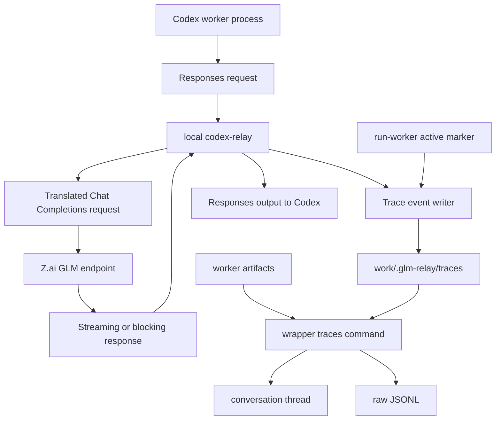
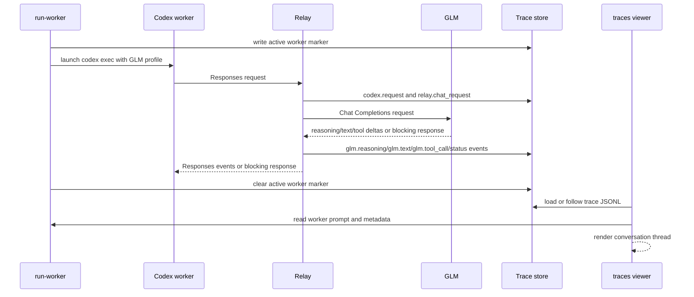

# GLM Trace Conversation Thread - Plan

## Goal Capsule

| Field | Value |
|---|---|
| Objective | Make GLM worker runs observable as a live, readable conversation thread that shows the worker prompt, relay request lifecycle, GLM output, reasoning, and tool calls without forcing the user to read raw Responses or Chat Completions payloads. |
| Authority | Preserve the current Codex-as-planner/reviewer workflow, local relay profile, JWT refresh wrapper, default tool denylist, offline reliability posture, and ignored local artifact storage. |
| Execution profile | Relay-first trace capture plus wrapper-side projection; prove the feature with offline Rust and Python tests before any optional live GLM smoke. |
| Stop conditions | Stop if the implementation would commit raw Z.ai keys, generated JWTs, bearer tokens, full environment dumps, relay history, worker run artifacts, or unredacted local trace output. |
| Tail ownership | The trace view explains what happened; it does not make GLM tool semantics stronger, approve worker changes, or replace Codex review. |

---

## Product Contract

### Summary

This plan adds a trace lane that turns hidden relay traffic into a conversation-style view for GLM worker runs.
The relay records local JSONL trace events at the boundary where Codex Responses requests become GLM Chat Completions requests and where GLM output returns.
The wrapper correlates those events with worker run artifacts and renders a simple thread by default, with raw protocol output available for debugging.

### Problem Frame

The current worker lane can run GLM and summarize the resulting artifact bundle, but the user cannot easily watch the model's work the way they would inside a native chat surface.
The important evidence is split across worker prompt files, relay logs, disk history, raw Responses request shapes, Chat Completions translations, stdout/stderr, and final git diff.
That makes the system harder to trust and harder to debug because the user has to understand the protocol before they can understand the conversation.

The next useful feature is not a dashboard first.
It is a durable local trace stream with a friendly projection on top.
That keeps the protocol evidence available for engineering while letting the default user experience read as "Codex asked GLM this, GLM thought or answered this, GLM selected these tools, and the worker finished this way."

### Requirements

#### Trace Capture

- R1. The relay writes local JSONL trace events for each handled Responses request when trace output is enabled.
- R2. Trace events include enough request context to understand model, stream mode, input messages, instructions, tool names/counts, previous response id, translated upstream request summary, response id, upstream status, reasoning deltas, text deltas, tool-call deltas, usage, completion, and failure.
- R3. Trace capture works for both streaming and blocking relay paths.
- R4. Trace writing never includes bearer tokens, generated JWTs, raw Z.ai keys, or environment dumps.
- R5. Trace files are stored only in ignored local state under the wrapper-managed relay workspace.

#### Worker Correlation

- R6. `run-worker` marks the currently active worker run so relay trace events can be tagged with that worker run id.
- R7. The active worker marker is written before the worker Codex process starts and is cleared when the worker run finishes, including preflight failures, timeouts, and nonzero exits.
- R8. Worker trace correlation remains best-effort: relay requests without an active worker marker are still traced under an orphan bucket rather than failing.
- R9. Worker metadata or review output points users to the trace command for the matching run when traces exist.

#### Conversation Projection

- R10. The wrapper exposes a trace viewing command that defaults to the latest worker run or latest trace run.
- R11. The default trace view renders a conversation-style thread: worker prompt, Codex-to-GLM request summary, system/instructions block, user input, GLM reasoning, GLM assistant text, tool call cards, tool result markers when present, and final status.
- R12. The default thread hides noisy protocol fields while preserving enough identifiers and timestamps to debug ordering.
- R13. A raw mode prints JSONL trace events for protocol debugging without requiring another provider call.
- R14. A full-prompts mode expands local prompt and request text for deep debugging while keeping the default view compact.
- R15. A follow mode streams new trace events as they arrive so the user can watch the worker run live.

#### Safety And Reliability

- R16. Offline tests cover trace event writing, active worker marker lifecycle, trace selection, thread projection, raw output, follow-mode helpers, redaction boundaries, and streaming/blocking instrumentation where practical.
- R17. Documentation explains the difference between raw traces, conversation thread projection, worker artifacts, relay logs, and relay history.
- R18. The feature stays local-first and does not add a web server, Desktop model-picker integration, or automatic acceptance of GLM output.
- R19. Existing wrapper commands and reliability fixtures continue to work without trace-specific flags.

### Acceptance Examples

- AE1. Given a worker run is active and Codex sends a streaming Responses request through the relay, when GLM returns reasoning and text deltas, then the trace file records ordered events tagged with that worker run id.
- AE2. Given no worker run is active, when the relay handles a request, then trace events are written under an orphan trace bucket and the relay response still succeeds or fails according to the upstream result.
- AE3. Given a worker run has prompt text and trace events, when the user runs the trace command in default mode, then stdout reads as a conversation thread instead of raw protocol JSON.
- AE4. Given the user passes raw mode, when trace events exist, then stdout contains valid JSONL events in original order.
- AE5. Given the user passes full-prompts mode, when prompt and request text are available, then the thread expands those local texts while still omitting credentials and environment values.
- AE6. Given a worker run times out before the relay receives a request, when the trace command targets that run, then the command explains that no trace events were found and still points at the worker artifacts.
- AE7. Given trace capture is disabled or the relay was started by an older wrapper version, when the trace command runs, then it reports the missing trace directory clearly.
- AE8. Given a trace event contains a tool call, when the thread renders it, then the tool name and argument preview appear as a tool card while the raw JSON remains available in raw mode.

### Scope Boundaries

In scope:

- Add relay-side JSONL trace writing behind wrapper-provided environment configuration.
- Add worker-run correlation through an active marker file.
- Add wrapper commands for thread, raw, follow, latest, and selected trace views.
- Update wrapper metadata and docs so users know where traces live and how to inspect them.
- Add offline tests in Rust and Python.

Deferred to follow-up work:

- Browser dashboard, menu-bar app, or desktop notification surface for traces.
- Codex Desktop model-picker integration.
- Stronger semantic tool understanding by GLM beyond schemas, prompt guidance, and translated selected tool calls.
- Automatic approval, revert, or apply logic based on trace contents.
- Centralized trace database, remote telemetry, or hosted sharing.
- Live CI against Z.ai credentials.

Outside this product's identity for this version:

- Capturing secrets, full environment dumps, or trace artifacts in git.
- Replacing Codex orchestration with a standalone GLM agent framework.
- Treating trace success as proof that GLM's code changes are correct.

---

## Planning Contract

### Key Technical Decisions

- KTD1. Capture traces inside the Rust relay.
  The relay sees both sides of the translation boundary, so it is the only place that can reliably connect Codex Responses requests, translated Chat Completions requests, GLM stream deltas, tool calls, and final Responses events without scraping logs.
- KTD2. Keep raw trace storage and conversation projection separate.
  JSONL events give engineers durable protocol evidence, while the wrapper can render those events into a friendly thread without losing the raw debug path.
- KTD3. Correlate worker runs through a local active marker.
  `run-worker` already owns worker run ids and artifact directories, so a marker file is the smallest bridge that lets the relay tag requests without changing Codex or relying on prompt parsing.
- KTD4. Store traces under ignored wrapper state.
  Traces can contain prompts, tool outputs, local paths, and repo context; they belong beside relay history in local sensitive state, not in tracked outputs.
- KTD5. Make tracing best-effort.
  Trace write failures should be logged and surfaced through tests, but they must not break the relay request path because the worker lane is still primarily an execution path.
- KTD6. Default to a readable thread, not a protocol tutorial.
  The user asked to abstract away complexity, so raw events, expanded prompts, and full payload details live behind explicit flags.
- KTD7. Avoid a dashboard in this unit of work.
  The fastest useful feature is a trace event contract plus CLI projection; a browser UI can build on that stable local evidence later.

### Assumptions

- The wrapper-managed relay process is the default path for GLM worker runs, so it can set trace-related environment variables when starting the relay.
- A worker run id can use the worker artifact directory name.
- Trace timestamps and append order are enough for the first thread view; no separate database or index is needed.
- Full local prompt viewing is acceptable only as an explicit debug flag because worker prompts and trace events are sensitive.
- The first follow mode can poll and render appended JSONL events; it does not need a websocket or browser runtime.

### High-Level Technical Design

### Sources & Research

- `third_party/codex-relay/src/main.rs` already owns request parsing, tool summaries, streaming/blocking branching, upstream URL construction, session storage, and blocking response translation.
- `third_party/codex-relay/src/stream.rs` already owns upstream SSE parsing, reasoning delta normalization, text delta translation, tool-call accumulation, usage handling, session persistence, and completion/failure event emission.
- `work/glm-relay` already owns relay lifecycle, environment setup, state files, worker run directories, prompt artifacts, metadata, review summaries, and argparse command registration.
- `tests/test_glm_relay_wrapper.py` already covers wrapper behavior using imported script helpers, temporary directories, monkeypatching, and fake subprocess results.
- `third_party/codex-relay/tests/fixtures/codex_glm_current/` already provides offline request and stream fixtures for protocol behavior.
- `README.md` and `work/glm-relay.md` already explain local sensitive data, worker artifacts, and the distinction between offline reliability checks and live GLM smoke tests.

### Risks & Dependencies

- Trace events can contain private prompts or tool outputs, so docs, storage paths, and tests must treat them as local sensitive data.
- Streaming instrumentation is easy to overfit to one provider's event shape; trace events should observe normalized relay concepts where possible.
- Best-effort trace writes must not hold locks across async network waits in a way that can stall the relay.
- Active marker lifecycle must clean up on preflight failure, worker timeout, and normal completion.
- Raw JSONL becomes a local debugging contract, so schema fields should be versioned and additive.
- The wrapper is a single Python script today; helper extraction should stay modest unless implementation complexity forces a module split.

---

## Implementation Units

### U1. Relay Trace Event Contract And Writer

- **Goal:** Add a small relay trace module that writes ordered JSONL events to local state when configured.
- **Requirements:** R1, R2, R4, R5, R8, R16.
- **Dependencies:** None.
- **Files:** `third_party/codex-relay/src/trace.rs`, `third_party/codex-relay/src/main.rs`, `third_party/codex-relay/src/lib.rs`, `third_party/codex-relay/Cargo.toml`, `third_party/codex-relay/tests/compat_codex_glm.rs`.
- **Approach:** Introduce a trace sink constructed from environment variables for trace directory and active marker path.
  Each handled request gets a trace id, optional run id, event sequence, timestamp, event name, and JSON data.
  The writer should create directories lazily, append one JSON object per event, and turn write failures into warnings rather than request failures.
  Summaries should include model, stream mode, response id, input/instruction text summaries, tool names, and upstream request shape without credentials.
- **Execution note:** Start with unit coverage for trace writer path creation, event ordering, marker parsing, and credential redaction before wiring it into request handling.
- **Patterns to follow:** Existing `SessionStore` configuration from environment, debug summary helpers in `main.rs`, and fixture-based Rust tests.
- **Test scenarios:**
  - Happy path: enabled trace sink writes two ordered JSONL events with the same trace id and run id.
  - Edge case: missing active worker marker tags the trace as orphan and still writes events.
  - Failure path: malformed active marker is ignored with a warning-shaped event or safe fallback.
  - Safety path: event data does not include API key strings, bearer header values, generated JWTs, or environment dumps.
  - Compatibility path: disabled trace sink performs no writes and leaves existing relay behavior unchanged.
- **Verification:** Rust tests prove the trace event contract without live Z.ai calls.

### U2. Instrument Blocking And Streaming Relay Paths

- **Goal:** Emit trace events around the actual Responses-to-Chat relay lifecycle.
- **Requirements:** R1, R2, R3, R4, R8, R16.
- **Dependencies:** U1.
- **Files:** `third_party/codex-relay/src/main.rs`, `third_party/codex-relay/src/stream.rs`, `third_party/codex-relay/src/translate.rs`, `third_party/codex-relay/tests/compat_glm_stream.rs`, `third_party/codex-relay/tests/regression_issues.rs`.
- **Approach:** Start a trace handle after a Responses request parses successfully.
  Emit a request summary before translation, an upstream request summary after translation, status events for upstream HTTP errors, normalized events for reasoning/text/tool-call stream deltas, usage events when available, and completed/failed events at the same decision points the relay already uses for Responses output.
  Pass a cloneable trace handle into `stream::translate_stream` so stream events are emitted from the SSE loop.
- **Execution note:** Keep trace calls adjacent to existing debug logs and response events so the trace cannot drift from behavior.
- **Patterns to follow:** Existing `response_tool_debug_names`, `chat_tool_debug_names`, stream accumulation fields, and completion/failure branches.
- **Test scenarios:**
  - Happy path: blocking text response emits request, upstream request, response, and completed events.
  - Happy path: streaming reasoning and text fixture emits reasoning/text delta events in order.
  - Happy path: streaming tool-call fixture emits tool-call events and completion.
  - Failure path: upstream HTTP error or request-body error emits a failed trace event.
  - Edge case: stream ending without `[DONE]` follows the same completion/failure choice already used by the relay.
- **Verification:** Existing offline protocol tests continue to pass, and added tests assert trace events for representative blocking and streaming fixtures.

### U3. Worker Active Marker And Trace Environment

- **Goal:** Let worker runs tag relay traces with the matching worker run id.
- **Requirements:** R5, R6, R7, R8, R9, R16, R19.
- **Dependencies:** U1.
- **Files:** `work/glm-relay`, `tests/test_glm_relay_wrapper.py`.
- **Approach:** Add constants for trace directory and active worker marker under `work/.glm-relay/`.
  `start_relay` should set trace directory and active marker environment variables for the relay process and save non-secret trace paths in state.
  `run-worker` should write a marker containing run id, run directory, prompt path, cwd, model, and start time before launching Codex, then clear it in `finally`.
  Metadata or summary output should mention the trace view command for the run when trace storage is configured.
- **Execution note:** Treat active marker cleanup as part of the worker lifecycle, not as a best-effort afterthought.
- **Patterns to follow:** Existing `STATE`, `STATE_FILE`, `WORKER_RUNS`, `write_json`, `run_worker` `finally` block, and secret hygiene tests.
- **Test scenarios:**
  - Happy path: `start_relay` passes trace directory and active marker paths to the relay environment and stores only non-secret paths in state.
  - Happy path: `run-worker` writes an active marker before subprocess execution and removes it afterward.
  - Failure path: preflight failure and timeout still remove the marker.
  - Safety path: marker and state do not include raw task prompt, raw key, generated JWT, or environment values.
  - Compatibility path: existing worker metadata fields remain present.
- **Verification:** Python unit tests cover marker lifecycle, environment configuration, and secret hygiene without live Codex or GLM.

### U4. Trace Loading And Conversation Projection

- **Goal:** Convert trace JSONL plus worker artifacts into a readable thread model.
- **Requirements:** R10, R11, R12, R13, R14, R16, R17.
- **Dependencies:** U1, U3.
- **Files:** `work/glm-relay`, `tests/test_glm_relay_wrapper.py`.
- **Approach:** Add helpers that resolve a trace target by worker run name, trace run id, explicit path, or `latest`.
  Load JSONL events tolerantly, group them by trace id, and build a projection with sections for worker prompt, system/instructions, user input, GLM reasoning, assistant output, tool calls, tool results, usage, and final status.
  Default output should truncate long text with clear continuation markers; full-prompts mode expands available local prompt/request text.
  Raw mode should print event JSONL unchanged after target resolution.
- **Execution note:** Build projection with fixture events before connecting the CLI command so the renderer is testable without spawning processes.
- **Patterns to follow:** Existing `load_worker_run`, `read_artifact_text`, `read_artifact_json`, `format_worker_review`, and warning accumulation helpers.
- **Test scenarios:**
  - Happy path: fixture trace plus prompt renders worker prompt, request, reasoning, assistant text, tool card, and completed status.
  - Edge case: no trace events for a selected worker run prints a clear missing-trace message and points to the worker artifact path.
  - Edge case: malformed JSONL line becomes a warning without discarding valid events.
  - Raw path: raw mode prints valid JSONL in original order.
  - Full prompt path: default mode truncates long prompt text while full-prompts mode expands it.
- **Verification:** Python unit tests assert thread rendering, raw output, target resolution, truncation, and warnings.

### U5. Trace CLI And Follow Mode

- **Goal:** Expose trace inspection through the wrapper as a small CLI surface that can be used live or after the run.
- **Requirements:** R10, R11, R12, R13, R14, R15, R16, R18, R19.
- **Dependencies:** U4.
- **Files:** `work/glm-relay`, `tests/test_glm_relay_wrapper.py`, `README.md`, `work/glm-relay.md`.
- **Approach:** Add a `traces` subcommand with a default target of `latest`, raw mode, full-prompts mode, follow mode, and bounded tail controls if useful.
  Follow mode can poll trace files and render newly appended events using the same projection primitives.
  The command must not require `ZAI_RAW_KEY`, must not start the relay, and must not mutate worker artifacts.
- **Execution note:** Keep live-follow behavior simple and deterministic enough that helper functions can be unit-tested offline.
- **Patterns to follow:** Existing `review-worker` CLI registration, text/JSON output handling, and docs style for local sensitive artifacts.
- **Test scenarios:**
  - Happy path: `traces latest` renders the newest trace-backed worker run.
  - Happy path: `traces <run-name> --raw` emits JSONL.
  - Happy path: follow helper detects appended events and renders only new content.
  - Failure path: missing trace directory exits with a clear message.
  - Safety path: trace commands do not call live GLM and do not require credentials.
- **Verification:** Python unit tests cover CLI argument wiring and helper behavior; docs explain commands and safety boundaries.

### U6. Documentation, Hygiene, And End-To-End Offline Proof

- **Goal:** Make the feature understandable and verify it as part of the existing offline reliability suite.
- **Requirements:** R16, R17, R18, R19.
- **Dependencies:** U1, U2, U3, U4, U5.
- **Files:** `README.md`, `work/glm-relay.md`, `tests/test_glm_relay_wrapper.py`, `third_party/codex-relay/tests/compat_codex_glm.rs`, `third_party/codex-relay/tests/compat_glm_stream.rs`.
- **Approach:** Update docs with the trace mental model: worker artifacts are run evidence, relay logs are operational logs, relay history is protocol memory, raw trace JSONL is local protocol evidence, and the trace thread is the human projection.
  Extend offline tests to prove the default commands and relay fixtures still pass.
  Scan for committed trace artifacts or credential-like strings before shipping.
- **Patterns to follow:** Existing README sections for offline reliability, fixture maintenance, worker lane, tool policy, and local data.
- **Test scenarios:**
  - Documentation path: trace commands and data directories are documented alongside existing worker commands.
  - Regression path: existing wrapper tests and relay fixture tests still pass.
  - Secret hygiene path: tracked files do not contain raw keys, generated JWTs, bearer tokens, or local trace JSONL artifacts.
  - Compatibility path: `run-worker`, `review-worker`, `live-smoke`, and profile writing behavior remain unchanged unless trace state is explicitly reported.
- **Verification:** Offline test suite passes, docs describe the new workflow accurately, and git status contains no local trace artifacts.

---

## Verification Contract

| Gate | Applies To | Done Signal |
|---|---|---|
| Python wrapper unit tests | U3, U4, U5, U6 | `python3 -m unittest discover -s tests` passes. |
| Rust relay tests | U1, U2, U6 | `cargo test --manifest-path third_party/codex-relay/Cargo.toml` passes where Rust tooling is available locally or in CI. |
| CLI smoke without credentials | U4, U5 | Trace commands can render fixture/local trace data without `ZAI_RAW_KEY` and without starting the relay. |
| Secret hygiene scan | U1, U3, U4, U6 | Tracked files contain no raw Z.ai keys, generated JWTs, bearer tokens, environment dumps, worker artifacts, or trace JSONL. |
| Documentation review | U5, U6 | README and wrapper notes explain trace storage, thread view, raw mode, follow mode, and local sensitivity. |
| PR CI | Full plan | GitHub Actions offline reliability checks pass on the branch. |

Live GLM smoke is optional after offline gates are green because it spends real provider calls and depends on credentials, provider availability, and account balance.

---

## Definition of Done

- Relay trace capture can be enabled by the wrapper and records ordered JSONL events for representative blocking and streaming requests.
- Worker runs are correlated to trace events through an active marker that is cleaned up on success and failure.
- The wrapper can render a selected or latest trace as a readable conversation thread.
- Raw JSONL and expanded prompt views are available through explicit flags.
- Follow mode can show appended trace events without a browser dashboard.
- Existing worker, review, profile, refresh, smoke, and fixture workflows remain compatible.
- Offline Rust and Python tests cover the new behavior and pass in CI.
- Documentation teaches the mental model without assuming prior protocol knowledge.
- Local sensitive trace output stays ignored and untracked.
- Abandoned experimental code and debug-only artifacts are removed from the diff before shipping.
